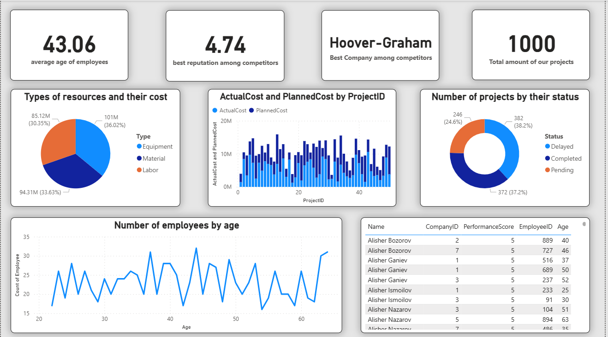

# Project Management Analytics Dashboard

Interactive Power BI dashboard developed to analyze project performance, costs, resources, project status, and employee indicators.

## Overview

The dashboard provides an analytical overview of project management data and helps compare planned and actual project costs, resource allocation, project statuses, company performance, and employee indicators.

## Key Metrics

- Total number of projects
- Planned vs. actual project costs
- Resource costs by type
- Project status distribution
- Employee age analysis
- Employee performance indicators
- Company performance comparison

## Dashboard Features

- Analysis of Actual Cost vs. Planned Cost by project
- Resource analysis by Equipment, Material, and Labor
- Project distribution by Delayed, Completed, and Pending status
- Employee demographic analysis
- Employee performance analysis
- Company comparison
- Interactive Power BI visualizations

## Technologies

- Power BI
- Power Query
- Excel

## Dashboard Preview

## Files

- Power BI dashboard (`.pbix`)
- Dashboard preview
- Project documentation

## Purpose

The project demonstrates the use of Power BI for data transformation, analytical reporting, KPI monitoring, and interactive data visualization.
